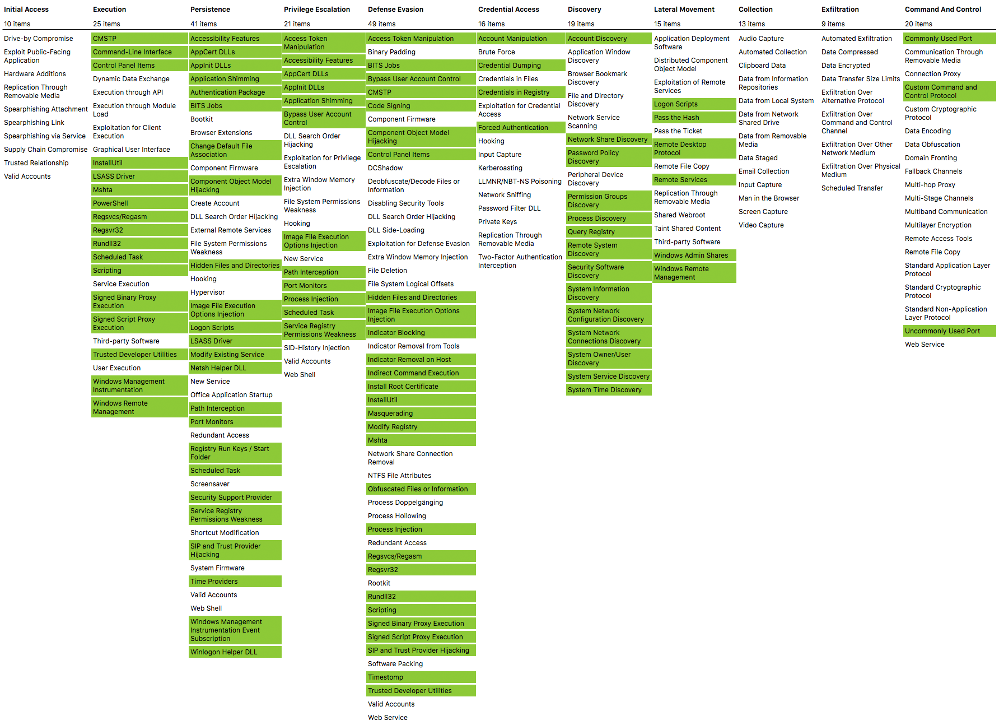

# sysmon-modular | A Sysmon configuration repository for everybody to customise

This is a Microsoft Sysinternals Sysmon configuration repository, set up modular for easier maintenance and generation of specific configs.

## NOTICE; Sysmon 8.02 is not compatible with this configuration, it will cause severe blind spots in your logging. Please use Sysmon 8.0 or 8.0.4

**Note:**
I do recommend using a minimal number of configurations within your environment for multiple obvious reasons, like; maintenance, output equality, manageability and so on.

Big credit goes out to SwiftOnSecurity for laying a great foundation and making this repo possible!
**[sysmonconfig-export.xml](https://github.com/SwiftOnSecurity/sysmon-config/blob/master/sysmonconfig-export.xml)**.

Equally a huge shoutout to **[Roberto Rodriguez](https://twitter.com/cyb3rward0g)** for his amazing work on the **[ThreatHunter-Playbook](https://github.com/Cyb3rWard0g/ThreatHunter-Playbook.git)** and his contribution to the community on his **[blog](https://cyberwardog.blogspot.nl)**.

Final thanks to **[Matt Graeber](https://twitter.com/mattifestation)** for his PowerShell Modules, without them, this project would not have worked as well.

Pull requests / issue tickets and new additions will be greatly appreciated!

I started a series of blog posts covering this repo;
- [Endpoint detection Superpowers on the cheap - part1 - MITRE ATT&CK, Sysmon and my modular configuration](https://medium.com/@olafhartong/endpoint-detection-superpowers-on-the-cheap-part-1-e9c28201ac47)
- [Endpoint detection Superpowers on the cheap — part 2 — Deploy and Maintain](https://medium.com/@olafhartong/endpoint-detection-superpowers-on-the-cheap-part-2-deploy-and-maintain-d06580329fe8)
- [Endpoint detection Superpowers on the cheap — part 3 — Sysmon Tampering](https://medium.com/@olafhartong/endpoint-detection-superpowers-on-the-cheap-part-3-sysmon-tampering-49c2dc9bf6d9)

Following this blogpost [Sysmon 8.0, a leap forward in event annotation](https://medium.com/@olafhartong/sysmon-8-0-a-leap-forward-in-event-annotation-59a36555d856) I've been working on updating the configuration modules to schemaversion 4.1 as well as adding the MITRE annotation fields. Eventually I deviated a little bit from my blogpost and went with the OSSEM field naming; technique_id and technique_name

## Mitre ATT&CK

I strive to map all configurations to the ATT&CK framework whenever Sysmon is able to detect it.
A current ATT&CK navigator export of all linked configurations is found [here](attack_matrix/Sysmon-modular.json) and can be viewed [here](https://mitre.github.io/attack-navigator/enterprise/#layerURL=https%3A%2F%2Fraw.githubusercontent.com%2Folafhartong%2Fsysmon-modular%2Fmaster%2Fattack_matrix%2FSysmon-modular.json&scoring=false&clear_annotations=false)

## Required actions

I highly recommend looking at the configs before implementing them in your production environment. This enables you to have as actionable logging as possible and as litte noise as possible.

### Prerequisites

Install the PowerShell modules from **[PSSysmonTools](https://github.com/olafhartong/PSSysmonTools)**

    git clone https://github.com/olafhartong/PSSysmonTools.git
    cd PSSysmonTools
    Import-Module .\PSSysmonTools.psm1

### Customization

You will need to install and observe the results of the configuration in your own environment before deploying it widely.
For example, you will need to exclude actions of your antivirus, which will otherwise likely fill up your logs with useless information.

### Generating a config

#### PowerShell

    git clone https://github.com/olafhartong/sysmon-modular.git
    cd sysmon modular
    .\Generate-Sysmon-Config.ps1

Optionally you can omit the comments from the merged config with the “-ExcludeMergeComments” switch.

You might see an error like ; *Merge-SysmonXMLConfiguration : The schema version of C:\Temp\sysmon-modular-master\sysmonconfig.xml () does not match that of the reference configuration:*
The error is due to the validator. When executing the oneliner the sysmonconfig.xml is created but it is still empty at that time. Therefore it is not a valid config at that time, the file is filled with data at the end of the generation phase. You can safely ignore it.

You can test your config if it's schema compliant

    Test-SysmonConfiguration .\sysmonconfig.xml

#### SysmonShell

This repository also was made available within **[SysmonShell](https://github.com/nshalabi/SysmonTools)** a great tool by **[Nader Shalabi](https://twitter.com/nader_shalabi)**

## Use

### Install

Run with administrator rights

    sysmon.exe -accepteula -i sysmonconfig.xml

### Update existing configuration

Run with administrator rights

    sysmon.exe -c sysmonconfig.xml

### Todo

- Link more indicators to Mitre ATT&CK techniques.
- Add / Improve comments
- Extend, extend, extend.
